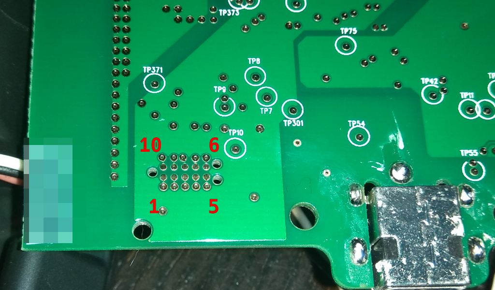

# Debug Port
## General

The debug port runs on `3.3 V`

## Layout 

The pins are accessible from the bottom side. Pinout according to Tag Connect 
footprint:


```
  10 9 8 7 6 
   1 2 3 4 5  
```



Fitting cable is an expensive [Tag Connect TC2050-IDC-NL](http://www.tag-connect.com/Materials/TC2050-IDC-NL%20Datasheet.pdf), for hands-free debugging the [TC2050-CLIP](http://www.tag-connect.com/TC2050-CLIP) is needed.

## Pinout


| Pin | Function | Comment               |
| --- | -------- | --------------------- |
| 1   | TX       | 55                    |
| 2   | RX       | 57                    |
| 3   | VCC      | 3.3V                  |
| 4   | RST      | 32                    |
| 5   | GND      |                       |
| 6   | ?        |                       |
| 7   | TCK      | 19                    |
| 8   | TMS      | 20                    |
| 9   | SOP2     | 21 (indirect SOP0 35) |
| 10  | ?        |                       |


# Extract Firmware
## Introduction
Grab your favourite USB-UART 3.3V interface, recommending those with DTR and RTS port to automate board reset + bootflag (SOP2). You may also use a CC3200 Launchpad, but then you will need to reset it by hand.
## Bootloader
To be able to extract the firmware you will need to pull SOP2 high and reset the device.
## Toolset
Use [cc3200tool](https://github.com/ALLTERCO/cc3200tool) to extract the firmware.
1. Extract full firmware `cc3200tool -p /dev/ttyUSB2 --sop2 ~dtr --reset rts read_flash firmware.dmp`
2. List files in FatFS `cc3200tool -p /dev/ttyUSB2 --sop2 ~dtr --reset rts list_filesystem`
3. Extract the files you like `cc3200tool -p /dev/ttyUSB2 --sop2 ~dtr --reset rts read_file /sys/mcuimg.bin ./sys/mcuimg.bin`